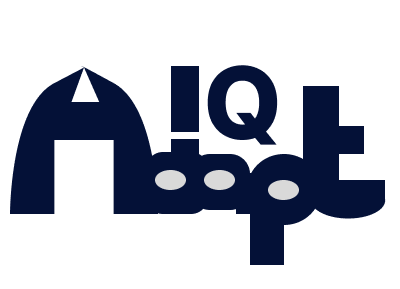

# AdaptIQ Learning Platform



AdaptIQ is an intelligent, personalized learning platform that adapts to individual learning styles and preferences. The platform uses advanced algorithms to create optimized study schedules and personalized learning paths for students.

## Features

- **Personalized Learning Experience**: Adapts to individual learning styles (visual, auditory, reading/writing, kinesthetic)
- **Intelligent Schedule Generator**: Creates optimized study schedules based on user preferences and learning patterns
- **Multi-Channel Methodology (MCM) System**: Integrates various learning approaches for comprehensive education
- **Parent Access Portal**: Allows parents to monitor student progress and engagement
- **Learning Centers**: Provides access to physical learning locations
- **Comprehensive Dashboard**: Tracks progress, assignments, and course completion
- **Dark Mode Support**: Complete dark theme implementation across all platform components
- **AI-Powered Assignments**: Assignment generation system with Gemini AI integration (coming soon)
- **Advanced Progress Tracking**: Visual indicators and detailed progress history
- **Multiple Export Formats**: Schedule export in PDF and ODF formats
- **Subject-Specific Visualization**: Visual subject identification with custom images
- **Customizable Preferences**: Extensive settings for personalization

## Technologies Used

- **Frontend**: React 19 with Vite 6.2.0
- **UI Components**: Mantine UI library 7.17.2
- **Routing**: React Router v7.4.0
- **Animation**: Framer Motion for smooth transitions
- **Icons**: Tabler Icons, FontAwesome
- **State Management**: React Hooks and Context API
- **Backend** (planned): Firebase (Authentication, Firestore, Storage, and Cloud Functions)
- **AI Integration** (planned): Google Gemini API

## Getting Started

### Prerequisites

- Node.js (v18 or higher)
- npm or yarn

### Installation

1. Clone the repository
2. Install dependencies:
   ```
   npm install
   ```
3. Start the development server:
   ```
   npm run dev
   ```

## Project Structure

- `/src/components`: UI components organized by feature
- `/src/pages`: Page components for routing
- `/src/assets`: Images and static assets
- `/src/utils`: Utility functions including schedule algorithms
- `/src/context`: React context providers (including ThemeContext)

## Key Components

- **Onboarding Flow**: Multi-step process to collect user preferences
- **Schedule Generator**: Algorithm-based study schedule creation
- **Dashboard**: User interface for tracking progress and accessing courses
- **Assignment Management**: Weekly assignments with priority system and tracking
- **Course Learning Interface**: Multi-mode learning with chat, quiz, and resources
- **Settings Panel**: Comprehensive settings for user preferences
- **Export System**: PDF and ODF document generation

## Upcoming Features (2025-2026)

- Complete Firebase backend integration (Q2 2025)
- Mobile application (Q4 2025)
- Collaborative learning features (Q1 2026)
- Enhanced AI tutor capabilities
- Advanced analytics dashboard

## Documentation

For detailed technical documentation:
- [BACKEND.md](./BACKEND.md): Firebase implementation details
- [UPDATES.md](./UPDATES.md): Development updates and technical implementation details

## License

This project is licensed under the MIT License - see the [LICENSE](./LICENSE) file for details.

## Last Updated: March 31, 2025
